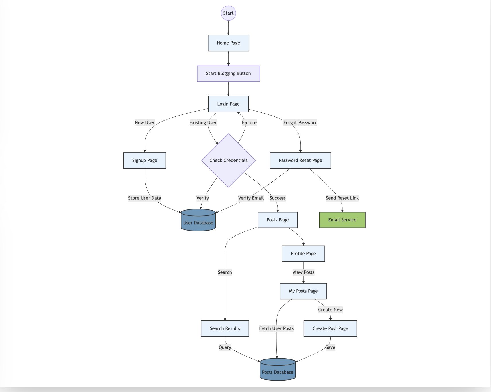

# Gator_Blog

## Team Members:
- **Durga Sritha Dongla [UFID - 54220803]** - Front End
- **KJ Pressly [UFID - 76473268]**  - Front End
- **Saranya Yadlapalli [UFID - 37282017]** - Back End
- **Sai Harshitha Baskar [UFID - 49831986]** - Back End

## Project Description:
The UF Student Blog Website is an interactive platform designed to foster connection and community among students at the University of Florida. This application allows students to share life updates, create engaging blog posts, and stay connected with their peers.

This blog website is designed to be an inclusive digital space where UF students can express themselves, share ideas, and build a stronger sense of community.
  
## Workflow:



## How to Run:

### Prerequisites:
- **Node.js** (v16.0.0 or higher)
- **npm** (v7.0.0 or higher)
- **Go** 1.23.4 or later
- **MySQL Server**
- **Redis Server**

### Backend execution command
```
cd backend
go mod tidy
go run server.go
```

### Frontend execution command
```
cd frontend
npm install
npm start
```

## 🛠️ Technology Stack

### Backend
- **Go Fiber**: Used as the lightweight web framework for building RESTful APIs.
- **MySQL**: The relational database used for storing users, blogs, likes, and comments.
- **Redis**: Used for caching frequently accessed blog data to improve performance.
- **JWT (JSON Web Tokens)**: Used to secure user sessions and restrict access to protected routes.

### Frontend
- **React**: JavaScript library for building user interfaces.
- **React Router DOM**: For handling navigation and routing within the application.
- **TailwindCSS**: Utility-first CSS framework for styling the application.
- **Context API**: For state management across components.
- **Cypress**: For end-to-end testing of the application.

---

## 🔐 User Authentication & Security

- The `/signup` and `/signin` routes handle user registration and login.
- Passwords are securely hashed using **bcrypt** before storage.
- On successful login, a **JWT token** is generated and sent back to the user.
- All sensitive blog-related routes are protected using middleware that verifies the JWT.
- Auth Context in React to maintain user session and provide authentication status across components.

#### Endpoints:
```
POST /api/signup  
POST /api/signin  
```

- Forgot password functionality is handled via **email verification** and **code-based reset**.

---

## 📱 Frontend Features

### 🧩 Components Architecture

The frontend is built with a modular component architecture:

- **Authentication Components**:
  - Login Form
  - SignUp Form
  - Forgot Password Flow

- **Blog Management Components**:
  - Dashboard
  - Post Creation Editor
  - Post Detail View
  - Post Edit Interface

- **User Profile Components**:
  - Profile Page
  - Personal Post Management

- **Interactive Elements**:
  - Like Button
  - Comment Section
  - Rich Text Editor

### 🎨 UI Design 

- UF-themed color scheme (blue and orange)
- Responsive design for all device sizes
- Accessible UI components
- Interactive animations and transitions
- WYSIWYG editor for rich formatting of blog posts

### 📝 Rich Text Editor

- Bold, Italic, Underline text formatting
- Lists (ordered and unordered)
- Headings
- Image insertion
- Link creation
- Code blocks
- Text alignment options

### 🔄 State Management

- Context API for user authentication
- Local state for form management
- API service utilities for data fetching
- Error handling and loading states

---

## ✍️ Blog Management

Users can:
- Create new blogs with rich text formatting
- View their own blogs or all public blogs
- Update or delete blogs they own
- Search for blogs by title or content
- Like and comment on blogs

#### Endpoints:
```
GET    /api/blogs             ← Authenticated user's blogs (with caching)
POST   /api/blogs             ← Create a blog
PUT    /api/blogs/:id         ← Update a blog
DELETE /api/blogs/:id         ← Delete a blog
GET    /api/blogs/:id         ← Fetch a single blog (cached)
```

- Blogs are cached in Redis using a key pattern like `user:{userID}:blogs` and invalidated on write.

---

## 💬 Comments System

Each blog post can have multiple comments, allowing interaction between users.

#### Endpoints:
```
POST /api/blogs/:id/comments  ← Add comment to a blog  
GET  /api/blogs/:id/comments  ← Fetch all comments for a blog
```

- Comments are stored in the `comments` table with `user_id` and `blog_id` as foreign keys.
- The frontend displays comments in chronological order with user attribution.

---

## ❤️ Likes System

Blogs can be liked by users, with functionality to like only once per user per post.

#### Endpoints:
```
POST /api/blogs/:id/likes     ← Like a blog (one per user)
GET  /api/blogs/:id/likes     ← Get like count for a blog
```

- Likes are tracked in a separate table to prevent duplicates and allow analytics.
- The frontend Like Button component visually indicates whether the current user has already liked a post.

---

## 🔍 Advanced Features

### ✅ Blog Search & Filter
Both personal and global blog endpoints support full-text filtering on title and post.

#### Endpoints:
```
GET /api/blogs-with-meta?search=go  
GET /api/all-blogs-with-meta?search=redis  
```

### 📊 Top Popular Blogs

```
GET /api/top-popular-blogs
```
- This endpoint ranks the top 5 blogs by number of likes, across all users.
- The homepage displays these popular posts to increase engagement.

---

## 📦 Data Models

- **User**: Stores basic auth info  
- **Blog**: Each blog is associated with a user  
- **Comment**: Associated with blog + user  
- **Like**: Stores user-blog likes for uniqueness  

Caching keys are used smartly to minimize DB queries.

---

## ⚙️ Caching Strategy

- Redis is used to cache blog lists and blog detail fetches by user.
- Cache invalidation occurs automatically on **create, update, delete** operations.

---

## 🔐 Security Measures

- JWT-secured endpoints
- Input validation using Go Fiber on backend
- Form validation in React components
- Rate-limiting and error handling to prevent abuse
- Reset codes expire in 10 minutes for secure password recovery
- Protected routes in React Router

---

## 📈 Scalability Considerations

- Redis caching for low-latency reads
- Clean separation of logic via controller/model structure
- RESTful route design that supports modular extension
- Component-based architecture for UI reusability

---

## 🧪 Testing

### Backend Testing
- Unit tests for controllers and models
- Integration tests for API endpoints

### Frontend Testing
- Component testing with React Testing Library
- End-to-end testing with Cypress covering:
  - Authentication flows
  - Blog creation, editing, and deletion
  - Like and comment functionality
  - Search and filter capabilities
  - Responsive design

---

## 📱 Responsive Design

- Mobile-first approach
- Tailwind CSS for responsive styling
- Media queries for custom breakpoints
- Optimized touch interactions for mobile users
- Flexible layouts that adapt to different screen sizes
